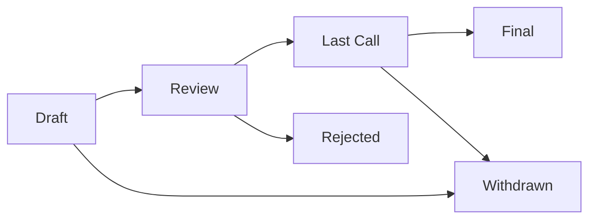

# ASI Improvement Proposal (ASIP) Process

## Overview

ASI Improvement Proposals (ASIPs) are design documents providing information to the ASI Chain community, describing new features, processes, or environments. ASIPs are the primary mechanism for proposing major changes to ASI Chain and documenting design decisions.

## ASIP Types

### Core
Changes that affect the consensus protocol, block or transaction validity rules, or any change that affects the interoperability of applications using ASI Chain.

### Networking
Improvements to network protocols, including peer discovery, message propagation, and synchronization mechanisms.

### Interface
Improvements to client API/RPC specifications and standards, including smart contract standards.

### Meta
Process ASIPs that describe a process surrounding ASI Chain or propose changes to the ASIP process itself.

### Informational
Design issues, general guidelines, or information for the ASI Chain community that doesn't propose a new feature.

## ASIP Workflow

### Status Definitions

**Draft** - An ASIP that is open for consideration and actively being discussed.

**Review** - An ASIP that is ready for review by the ASI Chain community and technical committee.

**Last Call** - Final review period (minimum 2 weeks) for an ASIP before moving to Final.

**Final** - An ASIP that has been accepted and implemented or ready for implementation.

**Rejected** - An ASIP that has been rejected by the community or technical committee.

**Withdrawn** - An ASIP that has been withdrawn by the author(s).

## Submission Process

### 1. Idea Discussion
Before creating an ASIP, discuss your idea:
- Open a discussion in the ASI Chain GitHub Discussions
- Present in community calls or forums
- Gather initial feedback from developers and users

### 2. Draft Creation
1. Fork the ASI Chain repository
2. Copy the ASIP template from `.github/ISSUE_TEMPLATE/asip_proposal.md`
3. Name your file `asip-XXXX-title.md` (XXXX will be assigned)
4. Fill out all required sections

### 3. Submit Draft
1. Create a Pull Request with your ASIP
2. The ASIP will be assigned a number
3. Community discussion begins on the PR

### 4. Review Process
- Technical committee reviews for completeness and feasibility
- Community provides feedback via PR comments
- Author addresses feedback and updates the proposal
- Minimum review period: 30 days for Core changes, 14 days for others

### 5. Decision
- Technical committee makes recommendation
- Community sentiment is gauged
- For Core changes: Requires 2/3 majority of active validators
- For other changes: Simple majority of technical committee

## ASIP Format

### Required Sections

**Header** - Metadata including ASIP number, title, author(s), status, type, and created date.

**Abstract** - Brief technical summary (200 words max).

**Motivation** - Why this change is needed.

**Specification** - Complete technical specification.

**Rationale** - Design decisions and alternatives considered.

**Backwards Compatibility** - Impact on existing implementations.

**Test Cases** - Required for Core ASIPs.

**Reference Implementation** - Recommended for Core and Interface ASIPs.

**Security Considerations** - Security implications and mitigations.

### Optional Sections

**Economic Considerations** - Impact on ASI token economics.

**Performance Analysis** - Benchmarks and performance impact.

**Future Work** - Potential extensions or improvements.

## Technical Committee

The ASI Chain Technical Committee consists of:
- Core developers from the ASI Alliance members
- Active validator representatives
- Community technical contributors

Committee members are selected based on:
- Technical expertise in blockchain and distributed systems
- Active contribution to ASI Chain development
- Commitment to the ASI Alliance mission

## Implementation

### For Accepted ASIPs

1. **Core ASIPs**: Require coordinated network upgrade
   - Implementation in reference client
   - Testnet deployment and testing
   - Validator coordination for mainnet activation
   - Activation at predetermined block height

2. **Interface ASIPs**: Can be implemented independently
   - Reference implementation provided
   - Libraries and tools updated
   - Documentation and examples created

3. **Meta/Informational ASIPs**: Adopted immediately upon acceptance

## ASIP Maintenance

- ASIPs are living documents
- Authors maintain ASIPs through the Draft stage
- After Final status, maintenance transfers to ASI Chain maintainers
- Significant changes require a new ASIP

## Appeals Process

If an ASIP is rejected:
1. Author may appeal to the ASI Alliance Governing Council
2. Requires demonstration of:
   - Significant community support
   - Technical merit
   - Alignment with ASI Alliance goals
3. Council review within 30 days

## Examples and Templates

### Successful ASIPs (Hypothetical Examples)

**ASIP-0001**: Genesis Block Specification (Core)
- Defined initial chain parameters
- Set validator requirements
- Established token distribution

**ASIP-0002**: AI Agent Registration Standard (Interface)
- Standardized agent identity format
- Defined capability declarations
- Created discovery protocol

**ASIP-0003**: Governance Voting Mechanism (Meta)
- Established on-chain voting
- Defined quorum requirements
- Created proposal templates

## Resources

- [ASIP Template](.github/ISSUE_TEMPLATE/asip_proposal.md)
- [GitHub Discussions](https://github.com/asi-alliance/asi-chain/discussions)
- [Technical Committee Members](GOVERNANCE.md#technical-committee)
- [ASI Alliance Documentation](https://docs.superintelligence.io)

## Contact

For questions about the ASIP process:
- Open an issue with the `ASIP-process` label
- Contact the technical committee via GitHub
- Discuss in community forums

## Acknowledgments

The ASIP process is inspired by:
- Bitcoin Improvement Proposals (BIPs)
- Ethereum Improvement Proposals (EIPs)
- Python Enhancement Proposals (PEPs)